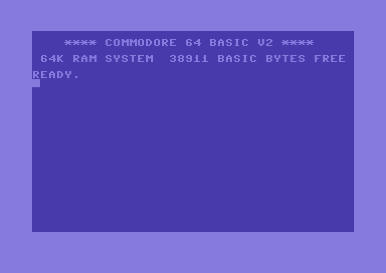
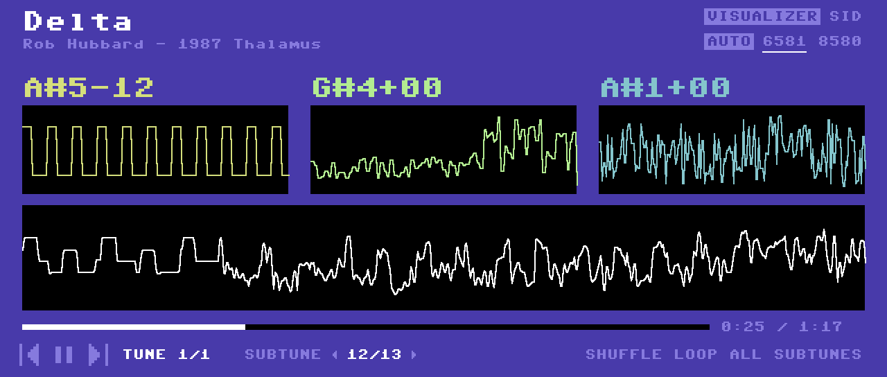
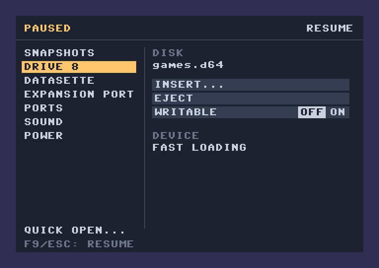

[](https://rubygems.org/gems/badline)
[](https://github.com/elektronaut/badline/actions/workflows/ci.yml)

# Badline



Badline is a Commodore 64 emulator written in Ruby. It emulates a PAL
or NTSC machine one clock cycle at a time, stepping the 6510, the VIC-II, both
CIAs and the SID together, so raster timing, bad lines and sprite DMA
are modelled at the cycle level.

It runs programs, disk and tape images, cartridges and SID tunes, and
the SDL2 front end supports the keyboard, joysticks, game controllers,
paddles and a 1351 mouse. It also runs a PAL VIC-20, as
`badline vic20`. See [What's emulated](#whats-emulated) for the details.

It comes in two builds of the same emulator:

- **`badline`**, compiled ahead of time with
  [Spinel](https://github.com/matz/spinel). It runs in real time with
  sound, so it's the one to play games with.
- **`badline-ruby`**, which comes with the Ruby gem and runs on CRuby. It
  runs slower than a real C64, so its sound is off by default. The gem is
  also a library, which runs a `Badline::Computer` from Ruby without a
  window.

## Installation

The native `badline`, with Homebrew:

```sh
brew install elektronaut/tap/badline
```

The formula builds it from the release's generated C, so it needs no
Spinel or Ruby. To build it from a checkout instead, see
[native/README.md](native/README.md).

The gem needs Ruby 4.0 or newer and the SDL2 library:

```sh
brew install sdl2           # macOS
apt install libsdl2-2.0-0   # Debian/Ubuntu
gem install badline
```

Or add `gem "badline"` to your Gemfile and run `bundle install`.

## Usage

Run `badline` with no arguments to boot to the BASIC prompt, or give it
something to load:

```sh
badline                # READY.
badline game.prg       # Load and run a program
badline game.d64       # Mount a disk image as device 8 and load it
badline game.tap       # Insert a tape and load it
badline game.crt       # Attach a cartridge
badline tune.sid       # Play a SID tune in the SID player
badline game.vsf       # Restore a snapshot, from badline or VICE
badline ~/c64          # Mount a directory as device 8
```

Programs, disk and tape images and SID tunes start automatically, and
a cartridge starts itself. A mounted directory waits for you to `LOAD`
from it.

The first argument can name the machine, as in `badline c64 game.prg`.
The C64 is the default, and `--model` picks which C64. See
[The VIC-20](#the-vic-20) for `badline vic20`.

`badline-ruby` takes the same media and the same options, with the
differences noted in the table. `--help` lists the options for either.

### Options

| Option | Effect |
| --- | --- |
| `--no-autostart` | Attach the media and stop at `READY.`, so you can type the `LOAD` yourself |
| `--writable` | Let the machine write to disk images. Without it, a disk goes in write-protected: the drive reports `26,WRITE PROTECT ON` for any write and the image file stays as it was |
| `--true-drive` | Put an emulated 1541 on device 8 instead of the KERNAL traps. See [Media](#media) |
| `-s`, `--subtune N` | Pick a subtune of a `.sid` file, counting from 1 |
| `--sid 6581`, `--sid 8580` | Fit the older or newer SID. `--sid auto`, the default, takes a `.sid` tune's own |
| `--ram SIZE` | Give a VIC-20 the RAM expansion `SIZE`: `unexpanded`, `3k`, `8k`, `16k`, `24k`, `32k` or `all`. Without it, the VIC-20 gets the expansion its media needs. See [The VIC-20](#the-vic-20) |
| `--reu SIZE` | Plug in a RAM Expansion Unit of `SIZE` K: 128, 256, 512 (a 1750) or up to 16384 |
| `--model NAME` | Run another model of the machine, named as in VICE. For the C64: `c64` (the default, a PAL C64 with the 6569 VIC-II, 6526 CIAs and the 6581 SID), `c64c` (the PAL C64C, with the 8565, 6526As and the 8580), `ntsc` (the 6567R8), `newntsc` (the NTSC C64C, with the 8562, 6526As and the 8580), `oldntsc` (the first NTSC C64s' 6567R56A), `drean` (the Drean C64 of Argentina, PAL-N with the 6572) or `sx64` (the portable SX-64, with its own KERNAL and no datasette). `--sid` or a `.sid` tune's own SID takes the model's place |
| `--ntsc` | Run an NTSC C64, as `--model ntsc` does |
| `--no-sound` | Don't play the SID (`badline` only, where sound is on by default) |
| `--sound` | Play the SID (`badline-ruby`, where sound is off by default) |
| `--no-vsync` | Pace the window by a timer, or by the sound while it plays, instead of the display's vsync |
| `--verbose` | Print the display's refresh rate, the sound's sample rate and the game controllers found as the window opens, then the frame rate and the time each frame takes, once a second |
| `--disable-jit` | Run without YJIT, otherwise switched on at startup (`badline-ruby` only) |
| `--version` | Show the version and what built it (`badline` only) |
| `-h`, `--help` | List the options |

### Scripted runs

| Option | Effect |
| --- | --- |
| `--frames N` | Quit after N frames |
| `--unpaced` | Run as fast as it can, without vsync or pacing |
| `--at FRAME:EVENT` | Press keys, type, swap media, open the pause menu or take a screenshot once `FRAME` frames have run |
| `--script FILE` | Run the events in `FILE`, one `FRAME:EVENT` a line |
| `--screenshot FILE` | Save the last frame as a `.bmp` |
| `--save-snapshot FILE` | Save the machine as a `.vsf` snapshot after the last frame |

```sh
badline --unpaced --frames 12000 --true-drive disk1.d64 \
  --at 3500:key=space --at 5600:insert=disk2.d64 \
  --at 250,500,6000:screenshot=shot%05d.bmp
```

`--help` lists the events, and [native/README.md](native/README.md#running)
describes them.

Other KERNAL, BASIC or character ROMs, and using badline as a Ruby
library, are covered in [doc/library.md](doc/library.md).

## Media

| Format | Handling |
|--------|----------|
| `.prg`, `.p00` | Loaded into memory after boot. A program at the BASIC start (`$0801`) is `RUN`, anything else is left for you to `SYS` |
| `.d64`, `.d71`, `.d81` | Mounted as device 8, then `LOAD"*",8,1` and `RUN`. Write-protected unless `--writable` |
| `.g64` | Put in a true 1541, then `LOAD"*",8,1` and `RUN`. It holds the disk's raw GCR, so copy protection that reads it works. Write-protected unless `--writable` |
| `.m3u`, `.vfl` | A list of disk images, one path a line, relative to the list: an `.m3u` playlist, or a VICE flip list, which only unit 8's entries are taken from. Its first disk goes in as above, and the list is its set for the pause menu |
| `.t64` | Mounted read-only as device 8 and loaded like a disk image. The files load by name, and no tape is involved |
| `.tap` | Inserted in the datasette with PLAY pressed, then `LOAD` and `RUN`. It loads at the speed of a real tape |
| `.crt` | The hardware types listed under [Cartridges](#whats-emulated). Other types are rejected |
| `.sid` | PSID and RSID tunes, started through a small driver after boot |
| `.vsf` | A snapshot of a running machine, badline's own or one VICE's x64sc saved. See [Snapshots](#snapshots) |
| A directory | Mounted as device 8. It serves the `.prg` and `.p00` files in it and the contents of any `.t64`, and `SAVE` writes a new `.prg` |

Without `--true-drive`, device 8 is no drive at all but traps on the
KERNAL's disk routines. Loading is instant, but fast loaders and copy
protection that run code on the drive need `--true-drive`, which puts
an emulated 1541 there, running its own DOS at a real 1541's speed. Its
red LED lights in the bottom right corner of the border.
[doc/media.md](doc/media.md) has the details, and how to attach media
from Ruby.

## The VIC-20

`badline vic20` runs a PAL VIC-20, and takes the same media as the C64
apart from SID tunes:

```sh
badline vic20             # READY.
badline vic20 game.prg    # Load and run a program
badline vic20 game.d64    # Mount a disk image as device 8 and load it
badline vic20 game.tap    # Insert a tape and load it
badline vic20 game.crt    # Attach a cartridge
```

Without `--ram`, it picks the RAM expansion from where the program, or
the first program on a disk, loads: a BASIC program gets the expansion
its start of BASIC comes with, and more of BLK1 to BLK3 when it runs
past `$3FFF`. A program that loads at `$A000` is a cartridge's ROM, and
goes in as a `.crt` does. Disks go through the KERNAL traps or, with
`--true-drive`, a 1541, as on the C64. `F11`, `F12` and the pause menu
save and load the VIC-20 too, in badline's own snapshots: xvic's `.vsf`
files don't load.

## Snapshots

`F11` quicksaves the whole machine to the next of five slots in
badline's data folder, replacing the oldest, and `F12` restores the
newest, even after badline has quit and started again. badline also
autosaves every two minutes of play, and the pause menu's Snapshots page
saves under a name and loads any of them. Snapshots use
VICE's `.vsf` format: badline opens those x64sc saves, and x64sc opens
badline's. See [doc/snapshots.md](doc/snapshots.md) for where they're
kept, what they hold and how far the two agree.

## Playing and rendering SID tunes

```sh
badline tune.sid                                     # play a tune in the SID player
badline sid ~/C64Music/MUSICIANS/H/Hubbard_Rob       # play every tune below a directory
badline sid --headless tune.sid other.sid            # play a queue in the terminal
badline --seconds 180 tune.sid --audio-out out.wav   # render to a .wav or .aiff
```

The SID player plays a queue of tunes, looking up each subtune's length
and STIL entry in an HVSC collection. Its window shows each voice's
note and output, the SID's registers, envelopes and filter, and the
tune's STIL entry, and is worked with the mouse. Tunes for 2 or 3 SIDs
play in stereo. [doc/sid-player.md](doc/sid-player.md) covers the
options, the keys and the window.



## Input

Keys map by their position on a US keyboard, whatever the host's layout,
and Shift gives the C64's shifted character, not the host's: Shift-2
types `"`. These keys have no same-named host key:

| C64 | Host |
|-----|------|
| `RUN/STOP` | `Escape` |
| `CLR/HOME` | `Home` |
| `INST/DEL` | `Backspace` |
| `CRSR ⇔` / `CRSR ⇕` | `Right` / `Down`, and `Left` / `Up` for the shifted directions |
| `←` / `↑` | `` ` `` / `]` |
| `CTRL` | `Left Ctrl` |
| `C=` | `Left Alt` |
| `@` | `\` |
| `:` | `'` |
| `£` | `End` |
| `+` / `*` | Keypad `+` / Keypad `*` |
| `RESTORE` | `Page Up` |

`Tab` switches the keys between the C64 keyboard and the joysticks. The
window title shows where they go, and any device plugged into a control
port:

| Title | What the host drives |
|-------|----------------------|
| (none) | The keyboard |
| `[JOY 2]` / `[JOY 1]` | Arrows and Space (or Right Ctrl) are the joystick named, `WASD` and Left Shift the other. SWAP JOYSTICKS on the pause menu's Ports page swaps them |
| `[MOUSE 1]` / `[MOUSE 2]` | A 1351 mouse in control port 1 or 2 |
| `[PADDLE 1]` / `[PADDLE 2]` | A pair of paddles in control port 1 or 2 |

A 1351 mouse or a pair of paddles plugs into either port on the pause
menu's Ports page, and stays there whichever way `Tab` sends the keys.
While one is plugged in it holds the host mouse, and opening the pause
menu lets go. Moving it moves the 1351 or turns the two paddle knobs,
and the left and right buttons are the 1351's buttons, or the fire
buttons of paddles A and B. Games differ in which port they read.

Game controllers work in every mode. The first one is joystick 2 and
the second is joystick 1. The D-pad and left stick steer, the face and
shoulder buttons fire, and controllers can be connected or removed while
the emulator runs.

`F10` mutes and unmutes the sound, and the window title shows `[MUTED]`
while it's off.

## The pause menu

`F9` pauses the machine and opens a menu over the frozen picture, and
`F9` or `Esc` closes it again. On a Mac, hold `Fn` for `F9`, unless the
function keys are set to work as standard function keys. Up and Down move
through the rows, Right goes into a page and Left back out, and Return or
Space presses a row. A row with choices steps to the next. The mouse works
too.



| Page | What it holds |
|------|---------------|
| Snapshots | Quicksave, save under a name, load a named save, and the latest quicksaves and autosaves |
| Drive 8 | The disk: insert, eject, the previous or next disk of its set, and whether it's writable |
| Datasette | The tape: insert, eject, PLAY and REWIND |
| Expansion port | The cartridge: insert, remove, and its freeze button if it has one |
| Ports | The device in each control port, and where the keys go |
| Sound | Mute, and the SID's model |
| Power | Reset, power cycle and quit |

INSERT opens a file browser. A disk's set is the `.m3u` or `.vfl` list it
was opened from, or one in its folder that lists it. Without one, it comes
from the names in its folder: `Disk 1`, `Side B`, `d2`, TOSEC's
`(Disk 1 of 2)`, or a trailing `_1`, `_2` when the first of the set is
there. WRITABLE starts as
`--writable` sets it and stays as set for the next disk. Quick open starts
a file in a new machine, as the command line does. It asks first, as
inserting or removing a cartridge does, since each power cycles the
machine.

A disk, list of disks or tape dropped on the window goes into its drive. A cartridge,
program or `.sid` dropped on it opens the menu to ask first.

## What's emulated

- **6510**: every opcode, documented and undocumented, with per-cycle
  bus behaviour checked against the
  [65x02 single step tests](https://github.com/SingleStepTests/65x02).
- **Memory**: banking through the 6510 port, the cartridge lines and
  Ultimax mode, and the +60K and +256K RAM expansions.
- **VIC-II**: the PAL 6569, the C64C's 8565, NTSC's 6567R8, 8562 and
  6567R56A, and the Drean's PAL-N 6572 (`--model`): every graphics mode, sprites, collisions, bad lines,
  sprite DMA, the border and the light pen.
- **CIA 1 and 2**: the 6526 and the C64C's 6526A, with timers,
  time-of-day clocks, the serial shift register, the keyboard matrix
  and the control ports.
- **SID**: the 6581 and the 8580, filter and all.
- **REU**: the 1700, 1764 and 1750 and bigger units up to 16M
  (`--reu`), with DMA timed against the VIC's bad lines and sprites.
- **Datasette**: `.tap` playback.
- **VIC-20**: the 6502, the PAL 6561 VIC-I with its picture and sound,
  both 6522 VIAs, the keyboard, the joystick and RESTORE, RAM
  expansions up to 35K (`--ram`), cartridges, the datasette and the
  serial bus to device 8 (`badline vic20`).
- **1541**: an emulated drive running its own DOS (`--true-drive`).
- **Cartridges**: standard 8K, 16K and Ultimax, Simons' BASIC, Ocean,
  Fun Play / Power Play, Super Games, Epyx FastLoad, Westermann
  Learning, Rex Utility, C64 Game System / System 3, Dinamic, Zaxxon /
  Super Zaxxon, Magic Desk, Comal-80, EasyFlash, Mach 5, Pagefox, RGCD,
  GMod2 and GEO-RAM, and the freezers Action Replay (v4.2 to v6), Atomic
  Power / Nordic Power, Retro Replay / Nordic Replay, Final Cartridge III
  / III+ and the KCS Power Cartridge. Flash writes stay in memory.

Chip combinations `--model` doesn't name, and the cartridges' jumpers,
are built from Ruby: see [doc/library.md](doc/library.md).

Known gaps:

- `badline-ruby` runs below real time, so its sound, which `--sound`
  turns on, stutters: it plays in bursts with silent gaps between them.
- Without `--true-drive`, fast loaders and anything else that runs code
  on the drive won't work.

## Contributing

Bug reports, feature requests, and pull requests are welcome. Read [CONTRIBUTING.md](CONTRIBUTING.md) first. Report security vulnerabilities privately as described in [SECURITY.md](SECURITY.md).

[CONTRIBUTING.md](CONTRIBUTING.md) also covers running the tests and the
commit format, and the project has a
[code of conduct](CODE_OF_CONDUCT.md).

## License

Released under the [MIT License](MIT-LICENSE).

Badline bundles one piece of third-party software:
`lib/badline/roms/eapi/eapi-am29f040-14`, the EasyFlash flash driver
(EAPI) for the Am29F040, © 2009–2010 Thomas 'skoe' Giesel, assembled
unaltered from [its upstream source](https://gitlab.com/easyflash/eapi).
It isn't part of badline and is distributed under the zlib licence; see
[its README](lib/badline/roms/eapi/README) and
[LICENSE.md](lib/badline/roms/eapi/LICENSE.md).
